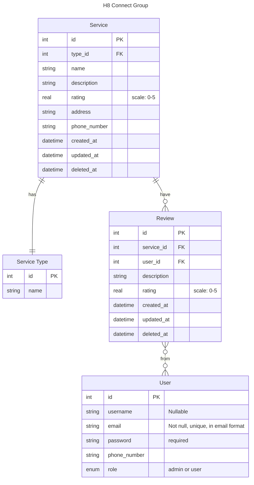
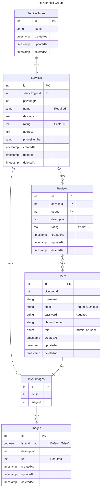

# GradXpert Final Project - Backend
## DRO
[Design, Requirement, and Objectives](https://docs.google.com/document/d/1xzJGHAJWesuQl7HHqg0dNCxhKBOVAP1KVf0cT62lHho/edit#heading=h.hqo576f2l496)

## ERD
### V1

### V2 - Implementation

## API Docs
See [this](./docs/api-docs.yml) using OpenAPI/Swagger Preview.